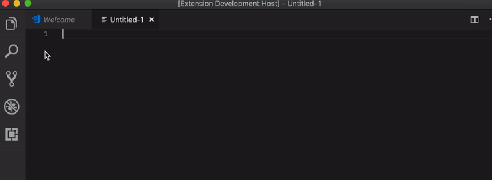

# Time For Humans

## Features

Time For Humans allows you to select a piece of text with a timestamp and add a comment after the selected text in a human format. Just select the text, right click, and you'll see Time for Humans option.

## Extension Settings

Work in progress. It will be available in future versions.

## Known Issues

It's working only selecting a string with numbers. If a non number char is included it will be ignored.

**Enjoy!**

Icons made by <a href="https://www.flaticon.com/authors/vectors-market" title="Vectors Market">Vectors Market</a> from <a href="https://www.flaticon.com/" 			    title="Flaticon">www.flaticon.com</a> is licensed by <a href="http://creativecommons.org/licenses/by/3.0/" 			    title="Creative Commons BY 3.0" target="_blank">CC 3.0 BY</a>
